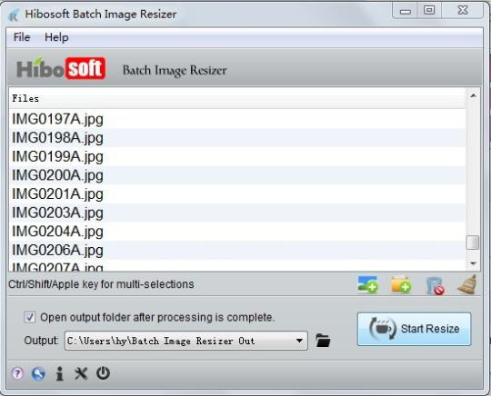
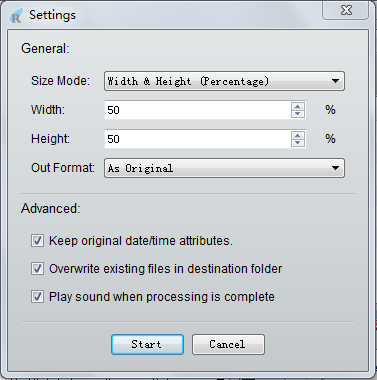
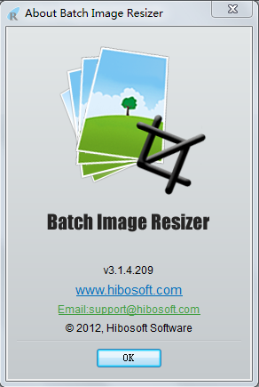

#About

This program was once released as a shareware, 
see [it on download.cnet.com](http://download.cnet.com/Hibosoft-Batch-Image-Resizer/3000-2192_4-75703618.html).

This program designed to resize large numbers of images/photos/pictures in seconds with just a few clicks. All popular image formats are supported.

#Screenshots

1. Screenshot of the main dialog.

1. Screenshot of the settings dialog.

1. Screenshot of the about dialog.

#Development

This program was developed by Python2, Qt4, PyQt4( Python2.7, Qt MinGW v4.8.0, and PyQT GPL v4.9.1).
And tested on Windows XP, Windows 7, and Windows 8. It should work on Mac OS X too.

I'm the author and the owner of this program.
Feel free to copy or change the code, or build a modified distribution.

